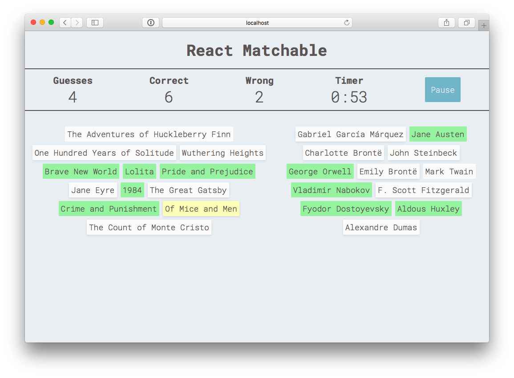

# React Matchable

A quiz app inspired by the Clickable Matching Quiz format by <a href="http://www.sporcle.com">Sporcle</a>

<a href="http://andybangs.com/react-matchable/">
  
</a>

#### React Matchable uses
- <a href="https://facebook.github.io/react/">React</a> for the UI
- <a href="https://github.com/reactjs/react-router">React Router</a> to keep the UI in sync with the URL
- <a href="https://github.com/reactjs/redux">Redux</a> for managing state
- <a href="https://github.com/yelouafi/redux-saga">Redux Saga</a> for managing side effects (async actions)
- <a href="http://stack.formidable.com/radium/">Radium</a> for additional inline styling capabilities
- <a href="https://lodash.com/">Lodash</a> for functional programming helpers

## Instructions to run locally
  
#### 1. Install dependencies

```$ npm install```

#### 2. Start mock quiz API

```$ npm run db```

#### 3. Start webpack dev server

```$ npm start``` in a new terminal tab or window
  
## Notes

- All state is stored in a single object, allowing view components to be pure functions

- Periodic updates to the timer are scheduled using a saga

- Quiz object can be configured to...
  - Contain 2 or more columns 
  - Sort columns alphabetically or randomly
  - Reveal correct answers on hover (Study Mode)
  - End when an incorrect answer is selected (Sudden Death)
  
## License

MIT
